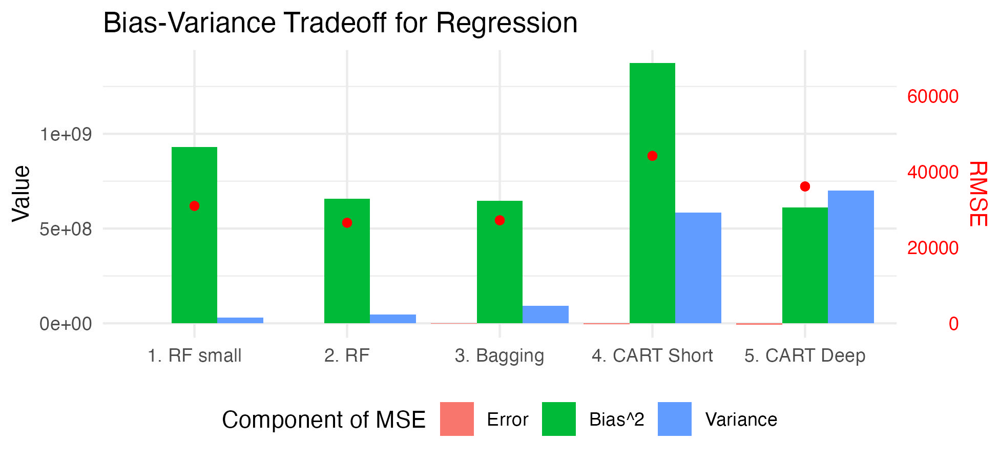
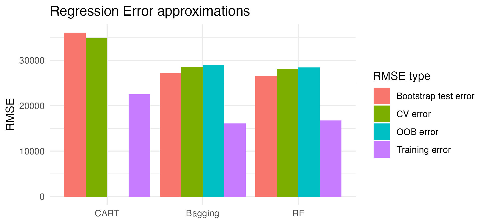
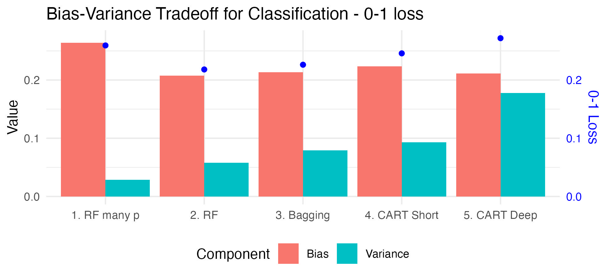
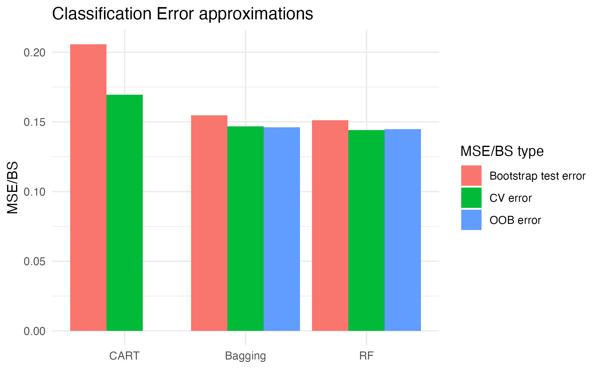

```{r setup, include=FALSE}
knitr::opts_chunk$set(include = FALSE)
```

# Introduction

The bias-variance tradeoff is a common framework for understanding the error of a prediction model in statistics and machine learning. Once a model is trained on some training data and evaluated on some test data, the mean square error (MSE) can be calculated, which is composed of the bias and the variance in the following way:

$MSE(\hat{f}(x)) = bias^2(f(x), \hat{f}(x)) + var(\hat{f}(x))$

The goal of most modeling pipelines is to minimize this MSE in some way, either by reducing the variance for simpler models, or reducing the bias for more complicated models. This is necessary because bias and variance have a fundamentally inverse relationship. Take an extremely simple model as an example, line a linear regression with only an intercept term. This model will make the same prediction $\hat{f}(x)$ for all test data points $x$. Thus the *variance* of the predictions will be low. At the same time, the difference between the predictions and the true values will be quite high, so we say the *bias* is high. On the other end of the spectrum, think of a very complex model like a neural network. The network can be trained to exactly predict every one of the training data points, so the variance of the predictions will be high. Meanwhile the difference between the predictions and the true values will be relatively low, so the bias will be low. 

Many examples of the bias-variance tradeoff treat this as mainly a theoretical construct, which it is. While the MSE can be mathematically decomposed into bias and variance terms, there are also error terms that are not accounted for. Furthermore, most textbook examples rely on simulated data in the regression setting only. Here, I will demonstrate the bias-variance tradeoff using real datasets, and apply it to both regression and classification. I will use various types of tree-based and ensemble models to do so, since these are relatively easy to understand but provide enough flexibility in their settings to demonstrate the changes in bias and variance. Finally, I will explore how well the MSE can be estimated by cross validation and out-of-bag error. 

# Methods

All analysis was conducted in R software using the `tidymodels` framework. Full code is available on the github repo [here](https://github.com/ravibrenner/p9120_final_project). I used the Ames housing data for regression tasks, and the Credit data for classification tasks, both provided as part of the `modeldata` subpackage of `tidymodels`. The workflow for regression and classification was similar, although a few key differences are discussed here. In brief, various models of varying complexity were fit, and their error, bias, and variance calculated via boostrapping.

For regression, the data were split with 80% going to training and 20% to testing. Five models were fit: a deep CART tree, a shallow CART tree, a bagging model, a typical random forest model with the number of predictors = p/3, and  random forest model with just 3 randomly chosen predictors. For all models, the minimum number of data points for a split was 20. The maximum depth of the deep tree was 30, and for the shallow tree was 3. For bagging and RF models, 100 trees were created and averaged.

For each model, 100 bootstrap samples of the training data were drawn, the model was trained on the 100 different training datasets, and then it was evaluated on the test set. This yielded 100 predictions for each test subject with which to calculate the bias^2, variance, and MSE. The bias^2 was calculated as the square of the difference between mean prediction for each subject and the subjects true value. The variance was calculated as the mean of the squared difference between each prediction and each subject's average prediction. The MSE was calculated as the mean of the square of the difference between each prediction and the true value. The irreducible error was also calculated as MSE - bias^2 - variance. In formula terms:

$E[(\hat{f}(x)-f(x))^2] = (E[\hat{f}(x)] - f(x))^2 + E[(\hat{f}(x)-E[\hat{f}(x)])^2] + \epsilon$

Note how the variance has no relationship to the true predictions $\hat{f}(x)$. It simply gives the variance of the predictions themselves.

As a secondary analysis, 10-fold cross validation was performed to compare the CV error and the OOB error from bagging and random forests with the test error estimated via bootstrapping described above.

For classification, some modifications were needed. The data were again split with 80% going to training and 20% going to testing, and 5 models were again fit. There were a few differences with the models. First for the typical random forest model, the number of randomly chosen predictors was $\sqrt{p}$. Second, because $\sqrt{p}$ was already quite small for the credit data, random non-informative predictors were added to the 5th random forest model (instead of using 3 randomly chosen predictors). Third, for the boostrapping procedure 101 replications were used instead of 100, to ensure no ties when calculating the modal prediction for a given individual. For the bagging and random forest models, probability averaging was used instead of consensus voting. The two methods generally give very similar results, but probability averaging has the advantage of allowing us to calculate the Brier score for all models. 

The Brier score has the same form as the MSE in regression, treating the probabilities as predictions and the outcomes as numeric 0 and 1. This further allows for decomposition of the MSE into "bias" and "variance" terms. Technically, these terms represent reliability and resolution, but the math works out to be identical to the regression case. As a sensitivity analysis, the 0-1 loss (misclassification error), bias, and variance can be calculated as follows. The loss for a given subject is the average number of times the predicted class does not equal the true class. The bias is a 1 if the modal class is not the true class, and 0 otherwise. The variance is the average number of times the predicted class does not equal the modal class. The results for this loss setup are also presented, but the values do not decompose as nicely--the bias and variance do not add up to the loss.

As a secondary analysis, 10-fold cross validation was performed to compare the CV error and the OOB error from bagging and random forests with the test error estimated via bootstrapping described above.

# Results

## Regression - Bias Variance Tradeoff

Results for the regression case are shown in the below figure. The green bars show the bias^2, the blue bars show the variance, and the red data points show the RMSE (the red bars representing the error terms are very small). The short regression tree (CART Short) has very high bias. The deep regression tree (CART deep) has much lower bias, and just slightly higher variance, resulting in a significant reduction in MSE. Bagging, which takes the average predictions of 100 deep trees, has similar bias to the deep regression tree, but much lower variance as expected from theory. Random forests modestly improved on this reduction in variance too, albeit with a slight increase in bias. Still, the MSE is lower than for bagging. Decreasing the number of randomly chosen predictors further, as in the small random forest (RF small) leads to even further reduction in variance--but now a substantial jump in bias leading to higher MSE.



## Regression - Training approximations (CV and OOB error)

The out-of-bag error (in blue; for bagging and RF) and cross validation error (in green; for all models) is shown below for the CART, bagging, and RF models fit earlier, along with the training error (in purple). Clearly, the training error does a poor job approximating the test error. Here, you can see that both cross validation and OOB error come fairly close to the error estimated from bootstrapping. The CV error is slightly lower than the bootstrap test error for CART, while the CV and OOB error is higher for bagging and RF. CV error also appears to be closer to the test error than OOB error.



## Classification - Bias Variance Tradeoff

Results for the classification case are shown in the below figure. The green bars show the bias^2, the blue bars show the variance, and the red data points show the MSE/Brier Score (the red bars representing the error terms are very small). The deep regression tree (CART deep) has high variance. The short regression tree (CART short) has much lower variance, and just slightly higher bias, resulting in a significant reduction in MSE. Bagging, which takes the average predictions of 100 deep trees, has similar bias to the deep regression tree, but much lower variance as expected from theory. Random forests modestly improved on this reduction in variance too, with a slight increase in bias. Adding many noninformative predictors to the data, as in the RF with many p, leads to even further reduction in variance, but with a substantial jump in bias and therefore MSE.


Qualitatively similar results for the 0-1 loss (misclassification error) are shown in the below figure. You can see that variance goes down from left to right, while bias goes up, resulting in the characteristic "U" shape in the loss function (blue points).



## Classification -  Training approximations (CV and OOB error)

The out-of-bag MSE/Brier Score (for bagging and RF) and cross validation error (for all) is shown below for the CART, bagging, and RF models fit earlier, along with the training error. Again, the training error does a poor job approximating the test error. Both cross validation and OOB error come fairly close to the error estimated from bootstrapping, with not much difference between CV and OOB error.



# Discussion

Classification and regression trees are easy to understand, but their simplicity means they have high variance. Averaging many such trees together as in bagging leads to a substantial reduction in variance. Random forests increases the complexity further by randomly choosing a fraction of the predictions for each bootstrap split, to decorrelate the trees. Taking this too far, however, by making this number very small or increasing the number of uninformative predictors can end up increasing bias. Hence a middle ground of complexity is more optimal. This is how you end up with the "U" shaped MSE curve in most textbook examples, with bias decreasing and variance increasing with increasing model complexity.

The traditional bias-variance-MSE curve depicted in most places has "model complexity" as a theoretical construct on the x-axis. A major takeaway of this analysis is that, in practice, the more "complex" models here like random forests actually had lower, not higher variance. So the notion of "complexity" should be taken in context of the overall modeling process at hand. Ensemble methods like bagging and random forests may not fit nicely on a scale of increasing complexity, since they are just averaging less complex predictors--hence they can maintain relatively low bias while also reducing variance. While we did not address gradient boosting, such algorithms take advantage of the U-shape to descend the error gradient and reach the point with lowest error. Their constituent learners are typically very simple, with high bias and low variance. Likewise with random forests: the individual trees are in some ways even simpler than the fully grown CART trees since they only use a subset of predictors, and then averaging reduces the variance, leading to lower MSE. Depending on how you choose to think about it, this is either more complex (bootstrapping, random sampling of predictors, averaging) or less complex (simpler trees with fewer predictors) than a single fully group CART tree. Hence some nuance is needed.

Cross validation is a good, easily applicable way to evaluate models, precisely because it does a good job approximating the test error. If you just looked at training error, you would constantly underestimate the test error. This is because you could get training error super low by increasing complexity of your model. Most modeling pipelines take this into account, and you always optimize the model parameters to minimize the MSE; that's the whole point of model tuning and training. Understanding the reasons for this are important.

Overall, there are some limitations of this analysis. Ultimately, we are still relying on simulation via bootstrapping. So even though we are trying to simulate the tradeoff using real datasets, there is an element of approximation. Additionally, this analysis was limited to relatively simple tree-based models. The ensemble methods used are mainly effective at reducing variance, but don't much impact bias. The traditional bias-variance tradeoff curve depicted in most textbooks, with variance increasing and bias decreasing with increasing model complexity was not exactly reproduced here, because the ensemble methods don't reduce bias much. Still, you can see nicely how the bias and variance decomposes with various tree based models, and the impact of bagging and random forests on reducing that variance. In conclusion, understanding the bias-variance tradeoff is crucial to the machine learning modeling process. Ensemble tree-based methods are some of the most popular tools for machine learning, hence understanding how they fit in to the bias-variance tradeoff is valuable for any statistician.
